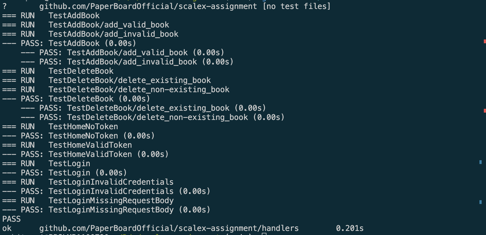

# Project Title

This is a Go project that provides a simple book management system. The project is structured as follows:


```
.
├── .env
├── data/
│   ├── adminUser.csv
│   └── regularUser.csv
├── go.mod
├── go.sum
├── handlers/
│   ├── auth.go
│   ├── book_test.go
│   ├── book.go
│   ├── home_test.go
│   ├── home.go
│   ├── login_test.go
│   └── login.go
└── main.go

```




## Description

The project includes several Go files that handle different aspects of the book management system:

- `auth.go`: Handles authentication-related operations.
- `book.go`: Handles operations related to books, such as adding and deleting books.
- `home.go`: Handles operations related to the home page.
- `login.go`: Handles login operations.

The `data` directory contains CSV files (`adminUser.csv` and `regularUser.csv`) that store book data for different types of users.

## Tests

The project includes unit tests for the book and home handlers (`book_test.go` and `home_test.go`). These tests ensure that the handlers function as expected.

## Setup

To set up the project, you need to create a `.env` file in the root directory of the project. This file should contain all the necessary environment variables required for the project.

## Running the Project

To run the project, use the following command:

```sh
go run main.go